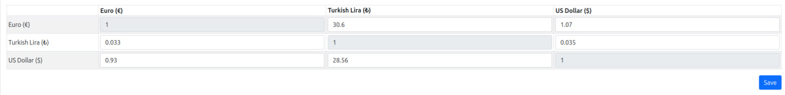

# Laravel Currency Converter

[](https://packagist.org/packages/onuraycicek/currency)
[](https://github.com/onuraycicek/currency/actions?query=workflow%3Arun-tests+branch%3Amain)
[](https://github.com/onuraycicek/currency/actions?query=workflow%3A"Fix+PHP+code+style+issues"+branch%3Amain)
[](https://packagist.org/packages/onuraycicek/currency)

## Installation

You can install the package via composer:

```bash
composer require onuraycicek/currency
```

```bash
php artisan vendor:publish --tag="currency-migrations"
php artisan vendor:publish --tag="currency-config"
php artisan vendor:publish --tag="currency-seeder"
php artisan migrate
php artisan db:seed --class=CurrencySeeder
```

## Usage



```php
	<x-currency-table></x-currency-table>
```

```php
	echo \Onuraycicek\Currency\Currency::convertWithId(53, 155, 100);
	echo \Onuraycicek\Currency\Currency::convert("TRY", "USD", 100);
```

## Config

```php
return [
    'theme' => 'bootstrap5',
    'currencies' => ['TRY', 'USD', 'EUR'],
];

theme: bootstrap5, bootstrap4 (not supported yet)
currencies: https://www.html-code-generator.com/php/array/currency-names
```


## Testing

```bash
composer test
```

## Credits

-   [onuraycicek](https://github.com/onuraycicek)

## License

The MIT License (MIT). Please see [License File](LICENSE.md) for more information.
